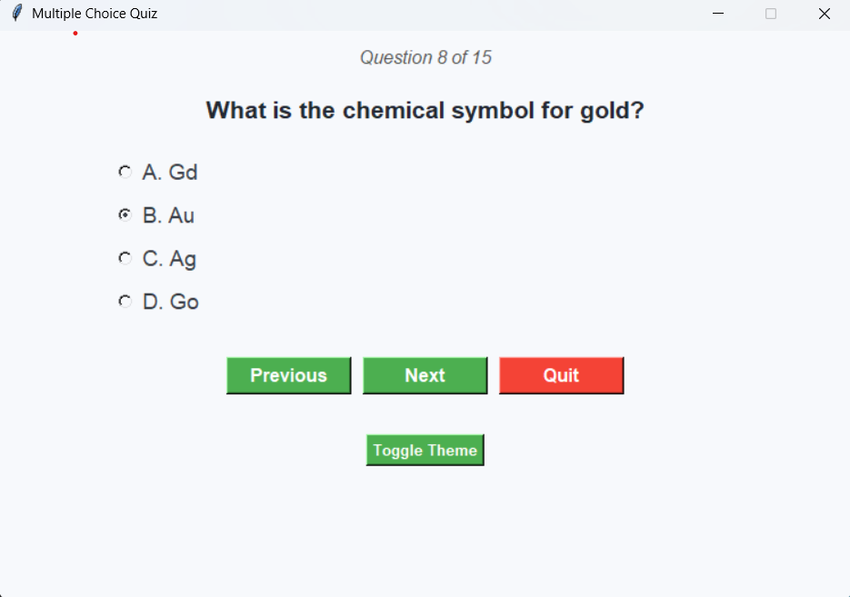

# 🎓 Multiple Choice Quiz App (Tkinter)

A beginner-friendly multiple-choice quiz application built with Python and Tkinter. This app provides a sleek interface with navigable questions, designed to help users test their general knowledge.

---

## 🖥️ Features

- 🧠 Multiple Choice Questions  
- 🔁 Previous/Next Question Navigation  
- ✅ Score Evaluation at the End  
- ⚠️ Answer Validation Prompt  
- ❌ Exit Anytime with Quit Button  

---

## 📸 Screenshot

| App Interface |
|---------------|
|  |

> Replace `screenshot.png` with your actual screenshot filename.

---

## 🚀 Getting Started

### Requirements

- Python 3.x  
- Tkinter  

### Run the App

```bash
python quiz_app.py
